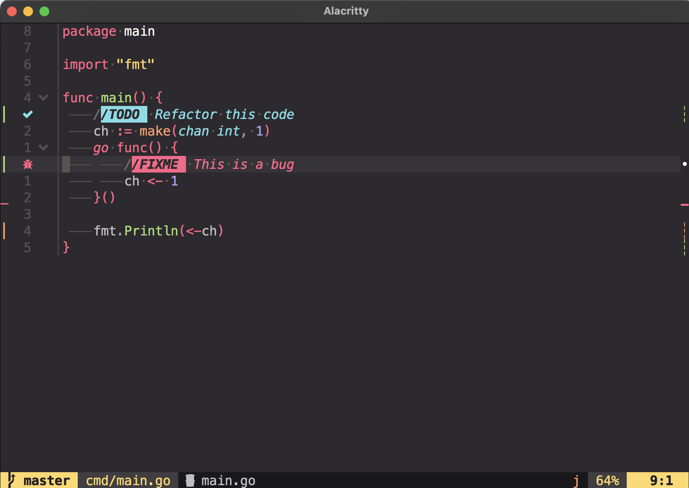

# My config files and settings

## Preview

## Plugins
- [lukas-reineke/indent-blankline.nvim](https://github.com/lukas-reineke/)
- [m4xshen/hardtime.nvim](https://github.com/m4xshen/hardtime.nvim)
- [MunifTanjim/nui.nvim](https://github.com/MunifTanjim/nui.nvim)
- [nvim-lua/plenary.nvim](https://github.com/nvim-lua/plenary.nvim)
- [mg979/vim-visual-multi](https://github.com/mg979/vim-visual-multi)
- [RRethy/vim-illuminate](https://github.com/RRethy/vim-illuminate)
- [github/copilot.vim](https://github.com/github/copilot.vim)
- [okuuva/auto-save.nvim](https://github.com/okuuva/auto-save.nvim)
- [petertriho/nvim-scrollbar](https://github.com/petertriho/nvim-scrollbar)
- [kevinhwang91/nvim-ufo](https://github.com/kevinhwang91/nvim-ufo)
- [kevinhwang91/promise-async](https://github.com/kevinhwang91/promise-async)
- [folke/which-key.nvim](https://github.com/folke/which-key.nvim)
- [loctvl842/monokai-pro.nvim](https://github.com/loctvl842/monokai-pro.nvim)
- [tpope/vim-fugitive](https://github.com/tpope/vim-fugitive)
- [lewis6991/gitsigns.nvim](https://github.com/lewis6991/gitsigns.nvim)
- [rmagatti/auto-session](https://github.com/rmagatti/auto-session)
- [smoka7/hop.nvim](https://github.com/smoka7/hop.nvim)
- [nvim-neo-tree/neo-tree.nvim](https://github.com/nvim-neo-tree/neo-tree.nvim)
- [nvim-tree/nvim-web-devicons](https://github.com/nvim-tree/nvim-web-devicons)
- [kdheepak/lazygit.nvim](https://github.com/kdheepak/lazygit.nvim)
- [nvim-telescope/telescope.nvim](https://github.com/nvim-telescope/telescope.nvim)
- [MeanderingProgrammer/markdown.nvim](https://github.com/MeanderingProgrammer/markdown.nvim)
- [nvim-treesitter/nvim-treesitter](https://github.com/nvim-treesitter/nvim-treesitter)
- [ThePrimeagen/harpoon](https://github.com/ThePrimeagen/harpoon)
- [mistricky/codesnap.nvim](https://github.com/mistricky/codesnap.nvim)
- [onsails/lspkind.nvim](https://github.com/onsails/lspkind.nvim)
- [iamcco/markdown-preview.nvim](https://github.com/iamcco/markdown-preview.nvim)
- [preservim/vim-pencil](https://github.com/preservim/vim-pencil)
- [epwalsh/obsidian.nvim](https://github.com/epwalsh/obsidian.nvim)
- [folke/zen-mode.nvim](https://github.com/folke/zen-mode.nvim)
- [tpope/vim-obsession](https://github.com/tpope/vim-obsession)
- [ThePrimeagen/git-worktree.nvim](https://github.com/ThePrimeagen/git-worktree.nvim)
- [tpope/vim-surround](https://github.com/tpope/vim-surround)
- [xiyaowong/nvim-transparent](https://github.com/xiyaowong/nvim-transparent)
- [rmagatti/goto-preview](https://github.com/rmagatti/goto-preview)
- [folke/trouble.nvim](https://github.com/folke/trouble.nvim)
- [folke/todo-comments.nvim](https://github.com/folke/todo-comments.nvim)
- [rcarriga/nvim-notify](https://github.com/rcarriga/nvim-notify)
- [folke/noice.nvim](https://github.com/folke/noice.nvim)
- [ray-x/go.nvim](https://github.com/ray-x/go.nvim)
- [ray-x/guihua.lua](https://github.com/ray-x/guihua.lua)
- [windwp/nvim-autopairs](https://github.com/windwp/nvim-autopairs)
- [neovim/nvim-lspconfig](https://github.com/neovim/nvim-lspconfig)
- [williamboman/mason.nvim](https://github.com/williamboman/mason.nvim)
- [williamboman/mason-lspconfig.nvim](https://github.com/williamboman/mason-lspconfig.nvim)
- [j-hui/fidget.nvim](https://github.com/j-hui/fidget.nvim)
- [hrsh7th/nvim-cmp](https://github.com/hrsh7th/nvim-cmp)
- [hrsh7th/cmp-nvim-ls](https://github.com/hrsh7th/cmp-nvim-ls)
- [L3MON4D3/LuaSnip](https://github.com/L3MON4D3/LuaSnip)
- [saadparwaiz1/cmp_luasnip](https://github.com/saadparwaiz1/cmp_luasnip)
- [nvim-treesitter/nvim-treesitter-textobjects](https://github.com/nvim-treesitter/nvim-treesitter-textobjects)
- [rcarriga/nvim-dap-ui](https://github.com/rcarriga/nvim-dap-ui)
- [mfussenegger/nvim-dap](https://github.com/mfussenegger/nvim-dap)
- [nvim-neotest/nvim-nio](https://github.com/nvim-neotest/nvim-nio)
- [theHamsta/nvim-dap-virtual-text](https://github.com/theHamsta/nvim-dap-virtual-text)
- [leoluz/nvim-dap-go](https://github.com/leoluz/nvim-dap-go)
- [nvim-lualine/lualine.nvim](https://github.com/nvim-lualine/lualine.nvim)
- [numToStr/Comment.nvim](https://github.com/numToStr/Comment.nvim)
- [tpope/vim-sleuth](https://github.com/tpope/vim-sleuth)
- [nvim-telescope/telescope-symbols.nvim](https://github.com/nvim-telescope/telescope-symbols.nvim)
- [nvim-telescope/telescope-fzf-native.nvim](https://github.com/nvim-telescope/telescope-fzf-native.nvim)
- [folke/twilight.nvim](https://github.com/folke/twilight.nvim)
