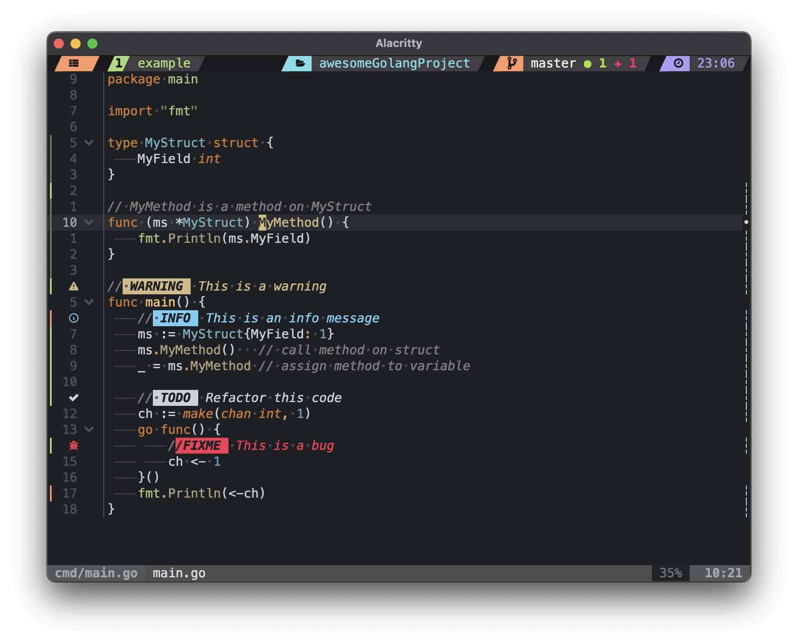
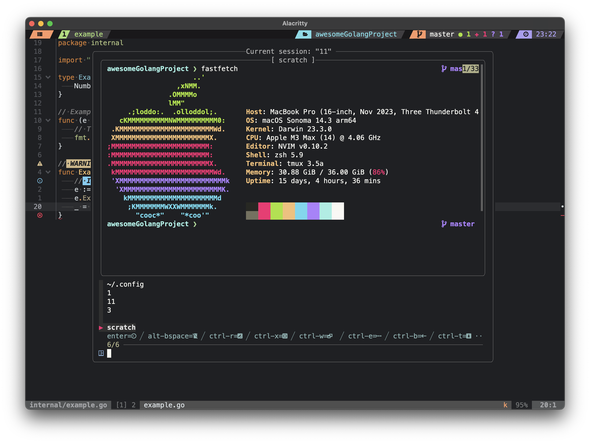
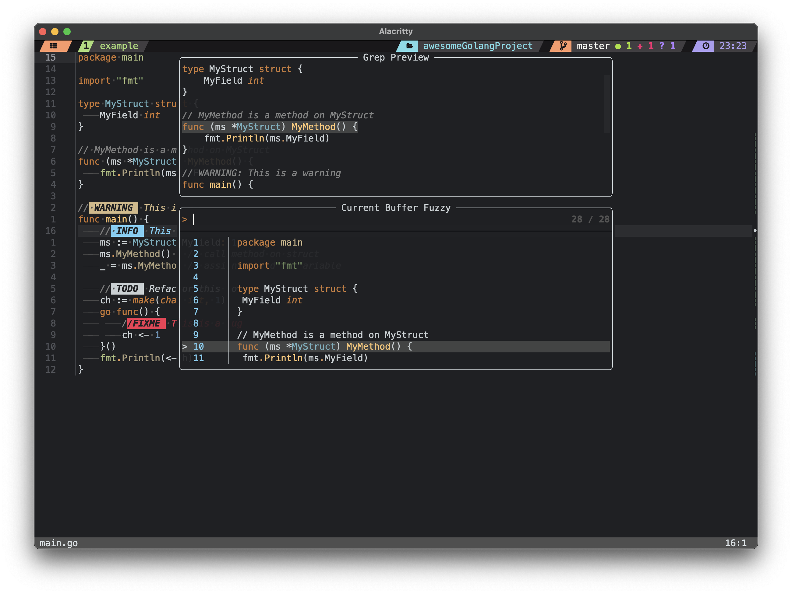
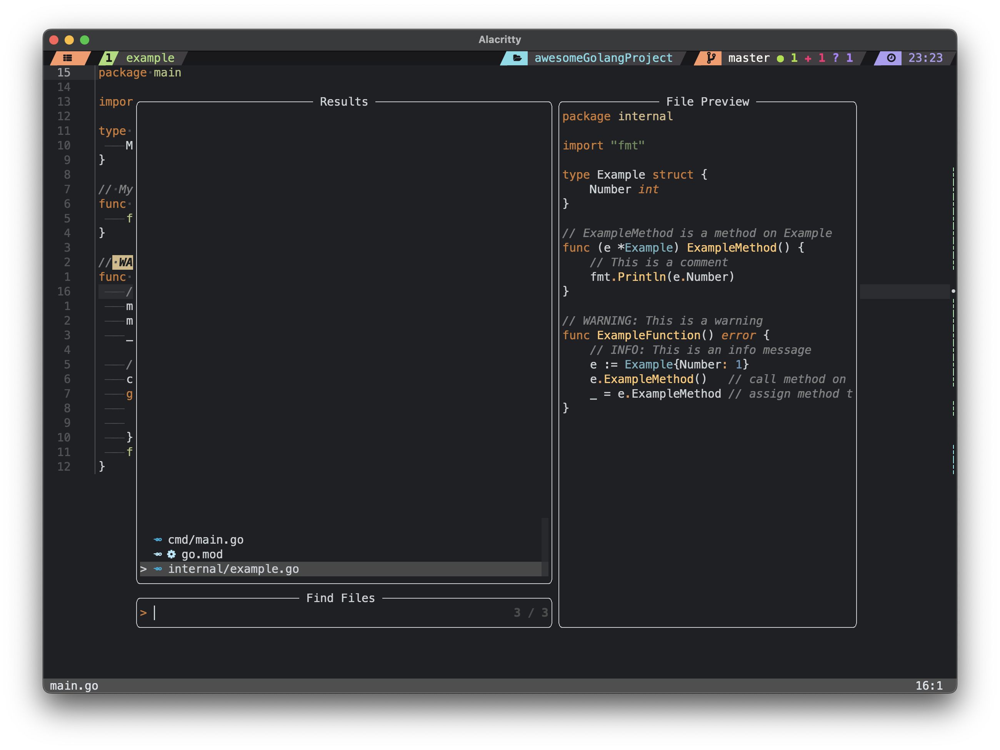
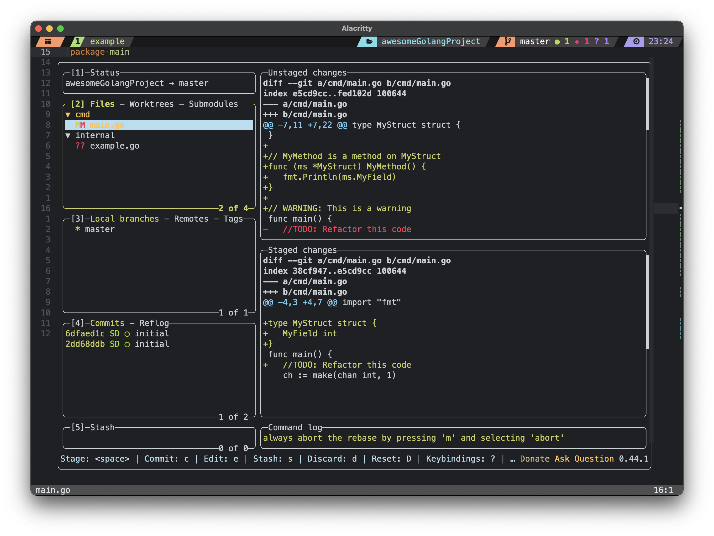

# My config files and settings

## Table of contents
- [Preview](#preview)
- [Installation](#installation)
  - [Prerequisites](#prerequisites)
  - [Steps](#steps)
- [Description](#description)
- [Screenshots](#screenshots)
  - [Trouble](#trouble)
  - [GotoPreview](#gotopreview)
  - [FloaX](#floax)
  - [SessionX](#sessionx)
  - [Telescope](#telescope)
    - [FindInBuffer](#findinbuffer)
    - [FindFiles](#findfiles)
    - [FindInFiles](#findinfiles)
  - [LazyGit](#lazygit)
  - [Neotree](#neotree)
- [Plugins](#plugins)

## Preview


## Installation

### Prerequisites
- [Neovim](https://github.com/neovim/neovim)
- [Alacritty](https://github.com/alacritty/alacritty)
- [Zsh](https://github.com/ohmyzsh/ohmyzsh)
- [Tmux](https://github.com/tmux/tmux)
- [Starship](https://github.com/starship/starship)
- [MesloLGS NF](https://github.com/ryanoasis/nerd-fonts/tree/master/patched-fonts/Meslo)

### Steps
##### Clone the repository
```bash
git clone https://github.com/sergei-durkin/dotfiles.git
```

##### Create a symbolic link to the `nvim` directory
```bash
ln -sf ~/dotfiles/nvim ~/.config/nvim
```

##### Create a symbolic link to the `alacritty` directory
```bash
ln -sf ~/dotfiles/alacritty ~/.config/alacritty
```

##### Create a symbolic link to the `zsh` directory
```bash
ln -sf ~/dotfiles/zsh ~/.config/zsh && \
ln -sf ~/.config/zsh/zshrc ~/.zshrc
```

##### Create a symbolic link to the `tmux` directory
```bash
ln -sf ~/dotfiles/tmux ~/.config/tmux && \
ln -sf ~/.config/tmux/tmux.conf ~/.tmux.conf
```

##### Create a symbolic link to the `starship` directory
```bash
ln -sf ~/dotfiles/starship ~/.config/starship
```

##### Create a symbolic link to the `fastfetch` directory
```bash
ln -sf ~/dotfiles/fastfetch ~/.config/fastfetch
```

##### Create a symbolic link to the `nix-darwin` directory
```bash
ln -sf ~/dotfiles/nix-darwin ~/.config/nix-darwin
```

##### Create a symbolic link to the `brew` directory
```bash
ln -sf ~/dotfiles/brew ~/.config/brew
```

##### Create a symbolic link to the `atuin` directory
```bash
ln -sf ~/dotfiles/atuin ~/.config/atuin
```

##### Create a symbolic link to the `skhd` directory
```bash
ln -sf ~/dotfiles/skhd ~/.config/skhd
```

##### Create a symbolic link to the `karabiner` directory
```bash
ln -sf ~/dotfiles/karabiner ~/.config/karabiner
```

##### Install TPM
Run git clone to install TPM and then press `prefix + I` to install plugins
```bash
git clone https://github.com/tmux-plugins/tpm ~/.tmux/plugins/tpm
```

#### Install `nix-darwin`
Follow the instructions from the [nix-darwin](https://github.com/LnL7/nix-darwin)

Then run the following command to install the packages
```bash
darwin-rebuild switch --flake $(readlink ~/.config/nix-darwin)#mbp
```

#### Git-Delta
```bash
ln -sf ~/dotfiles/git/delta ~/.config/git/delta
ln -sf ~/.config/git/delta/delta ~/.gitconfig
```

#### Git-Config
```bash
git config --global core.pager delta
git config --global interactive.diffFilter 'delta --color-only'
git config --global delta.navigate true
git config --global merge.conflictStyle zdiff3

git config --global core.editor "nvim"
```

---

### Description

 - Package manager `Nix` and `Homebrew`
 - Theme `darcula`
 - Editor `Neovim`
 - Terminal `Alacritty`
    - Shell `zsh`
    - Multiplexer `tmux`
    - Prompt `starship` or `powerlevel10k`
    - Font `MesloLGS NF` *download from [here](https://github.com/romkatv/powerlevel10k/blob/master/font.md)

---

## Screenshots

### Trouble
  - Keybinding: `<leader>xx`
  - Preview diagnostics: 
  - Keybinding: `<leader>xs`
  - Preview symbols: 
  - See more [here](./nvim/lua/plugins/trouble.lua)

---
### GotoPreview
  - Keybinding: `<leader>gp*` (where `*` is the `d - definition`, `r - reference`, `i - implementation`)
  - Preview: 

---

### FloaX
  - Keybinding: `<tmux-leader>p`
  - Preview: 

---

### SessionX
  - Keybinding: `<tmux-leader>o`
  - Preview: 

---

### Telescope

#### FindInBuffer:
  - Keybinding: `<command>f`
  - Preview: 

---

#### FindFiles:
  - Keybinding: `<leader>sf`
  - Preview: 

---

#### FindInFiles: 
  - Keybinding: `<command-shift>f`
  - Preview: 

---

### LazyGit
  - Keybinding: `<leader>lg`
  - Preview: 

---

### Neotree
  > _Looks bad with the current theme._
  > _May be I will fix it later._

  - Keybinding: `<leader>e`
  - Preview: 

---

## Nvim Plugins
- [xiantang/dacula-dark.nvim](https://github.com/xiantang/darcula-dark.nvim)
- [lukas-reineke/indent-blankline.nvim](https://github.com/lukas-reineke/indent-blankline.nvim)
- [MunifTanjim/nui.nvim](https://github.com/MunifTanjim/nui.nvim)
- [nvim-lua/plenary.nvim](https://github.com/nvim-lua/plenary.nvim)
- [RRethy/vim-illuminate](https://github.com/RRethy/vim-illuminate)
- [github/copilot.vim](https://github.com/github/copilot.vim)
- [okuuva/auto-save.nvim](https://github.com/okuuva/auto-save.nvim)
- [petertriho/nvim-scrollbar](https://github.com/petertriho/nvim-scrollbar)
- [kevinhwang91/nvim-ufo](https://github.com/kevinhwang91/nvim-ufo)
- [kevinhwang91/promise-async](https://github.com/kevinhwang91/promise-async)
- [folke/which-key.nvim](https://github.com/folke/which-key.nvim)
- [tpope/vim-fugitive](https://github.com/tpope/vim-fugitive)
- [lewis6991/gitsigns.nvim](https://github.com/lewis6991/gitsigns.nvim)
- [rmagatti/auto-session](https://github.com/rmagatti/auto-session)
- [echasnovski/mini.ai](https://github.com/echasnovski/mini.ai)
- [echasnovski/mini.jump2d](https://github.com/echasnovski/mini.jump2d)
- [echasnovski/mini.operators](https://github.com/echasnovski/mini.operators)
- [echasnovski/mini.surround](https://github.com/echasnovski/mini.surround)
- [nvim-neo-tree/neo-tree.nvim](https://github.com/nvim-neo-tree/neo-tree.nvim)
- [nvim-tree/nvim-web-devicons](https://github.com/nvim-tree/nvim-web-devicons)
- [kdheepak/lazygit.nvim](https://github.com/kdheepak/lazygit.nvim)
- [nvim-telescope/telescope.nvim](https://github.com/nvim-telescope/telescope.nvim)
- [MeanderingProgrammer/markdown.nvim](https://github.com/MeanderingProgrammer/markdown.nvim)
- [nvim-treesitter/nvim-treesitter](https://github.com/nvim-treesitter/nvim-treesitter)
- [onsails/lspkind.nvim](https://github.com/onsails/lspkind.nvim)
- [iamcco/markdown-preview.nvim](https://github.com/iamcco/markdown-preview.nvim)
- [preservim/vim-pencil](https://github.com/preservim/vim-pencil)
- [epwalsh/obsidian.nvim](https://github.com/epwalsh/obsidian.nvim)
- [folke/zen-mode.nvim](https://github.com/folke/zen-mode.nvim)
- [tpope/vim-obsession](https://github.com/tpope/vim-obsession)
- [ThePrimeagen/git-worktree.nvim](https://github.com/ThePrimeagen/git-worktree.nvim)
- [xiyaowong/nvim-transparent](https://github.com/xiyaowong/nvim-transparent)
- [rmagatti/goto-preview](https://github.com/rmagatti/goto-preview)
- [folke/trouble.nvim](https://github.com/folke/trouble.nvim)
- [folke/todo-comments.nvim](https://github.com/folke/todo-comments.nvim)
- [folke/noice.nvim](https://github.com/folke/noice.nvim)
- [ray-x/go.nvim](https://github.com/ray-x/go.nvim)
- [ray-x/guihua.lua](https://github.com/ray-x/guihua.lua)
- [windwp/nvim-autopairs](https://github.com/windwp/nvim-autopairs)
- [neovim/nvim-lspconfig](https://github.com/neovim/nvim-lspconfig)
- [williamboman/mason.nvim](https://github.com/williamboman/mason.nvim)
- [williamboman/mason-lspconfig.nvim](https://github.com/williamboman/mason-lspconfig.nvim)
- [j-hui/fidget.nvim](https://github.com/j-hui/fidget.nvim)
- [hrsh7th/nvim-cmp](https://github.com/hrsh7th/nvim-cmp)
- [hrsh7th/cmp-nvim-ls](https://github.com/hrsh7th/cmp-nvim-ls)
- [L3MON4D3/LuaSnip](https://github.com/L3MON4D3/LuaSnip)
- [saadparwaiz1/cmp_luasnip](https://github.com/saadparwaiz1/cmp_luasnip)
- [nvim-treesitter/nvim-treesitter-textobjects](https://github.com/nvim-treesitter/nvim-treesitter-textobjects)
- [rcarriga/nvim-dap-ui](https://github.com/rcarriga/nvim-dap-ui)
- [mfussenegger/nvim-dap](https://github.com/mfussenegger/nvim-dap)
- [nvim-neotest/nvim-nio](https://github.com/nvim-neotest/nvim-nio)
- [theHamsta/nvim-dap-virtual-text](https://github.com/theHamsta/nvim-dap-virtual-text)
- [leoluz/nvim-dap-go](https://github.com/leoluz/nvim-dap-go)
- [nvim-lualine/lualine.nvim](https://github.com/nvim-lualine/lualine.nvim)
- [numToStr/Comment.nvim](https://github.com/numToStr/Comment.nvim)
- [tpope/vim-sleuth](https://github.com/tpope/vim-sleuth)
- [nvim-telescope/telescope-symbols.nvim](https://github.com/nvim-telescope/telescope-symbols.nvim)
- [nvim-telescope/telescope-fzf-native.nvim](https://github.com/nvim-telescope/telescope-fzf-native.nvim)
- [folke/twilight.nvim](https://github.com/folke/twilight.nvim)
- [stevearc/oil.nvim](https://github.com/stevearc/oil.nvim)
- [rest-nvim/rest.nvim](https://github.com/rest-nvim/rest.nvim)

### Tmux Plugins
- [tmux-plugins/tpm](https://github.com/tmux-plugins/tpm)
- [sergei-durkin/monokai-pro.tmux](https://github.com/sergei-durkin/monokai-pro.tmux)
- [tmux-plugins/tmux-sensible](https://github.com/tmux-plugins/tmux-sensible)
- [tmux-plugins/tmux-resurrect](https://github.com/tmux-plugins/tmux-resurrect)
- [tmux-plugins/tmux-continuum](https://github.com/tmux-plugins/tmux-continuum)
- [omerxx/tmux-floax](https://github.com/omerxx/tmux-floax)
- [omerxx/tmux-sessionx](https://github.com/omerxx/tmux-sessionx)
- [tmux-plugins/tmux-yank](https://github.com/tmux-plugins/tmux-yank)
- [fcsonline/tmux-thumbs](https://github.com/fcsonline/tmux-thumbs)
- [sainnhe/tmux-fzf](https://github.com/sainnhe/tmux-fzf)
- [wfxr/tmux-fzf-url](https://github.com/wfxr/tmux-fzf-url)
